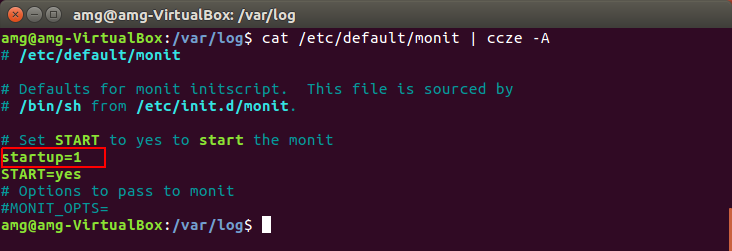
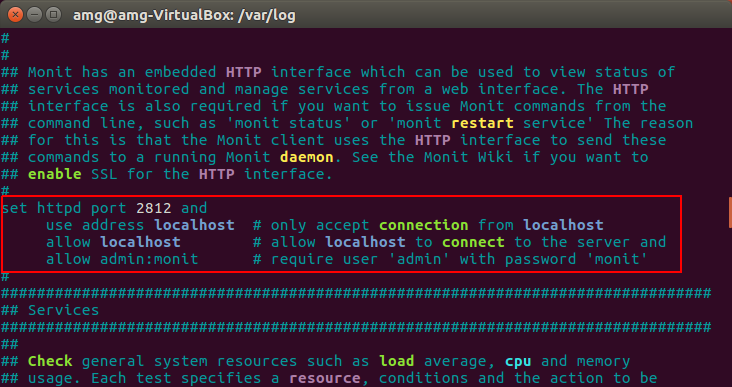
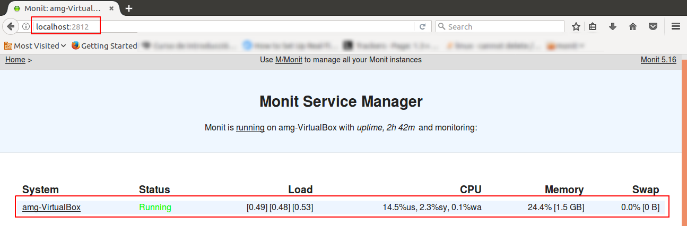

# Monit

__Monit__ is a free open source and very useful tool that automatically monitors and manages __server process, files, directories, checksums, permissions, filesystems__ and services like __Apache, Nginx, MySQL, FTP, SSH, Sendmail__ and so on in a __UNIX/Linux__ based systems and provides an excellent and helpful monitoring functionality to system administrators.

Monit has a ability to start a process if it is not running, restart a process if not responding and stop a process if uses high resources. Additionally you can also use Monit to monitor __files, directories__ and __filesystems for changes, checksum changes, file size changes__ or __timestamp changes__. With Monit you can able to monitor remote hosts __TCP/IP port__, __server protocols__ and __ping__. Monit keeps its own log file and alerts about any critical error conditions and recovery status.

The monit has user friendly web interface where you can directly view the system status and setup up processes using native HTTP(S) web server or via the command line interface. This means you must have web server like __Apache__ or __Nginx__ installed on your system to access and view monit web interface.

### Installing Monit

For Ubuntu/Debian/Linux Mint user’s can easily install using apt-get command as shown.  
```vim
$ sudo apt-get install monit
```
Once monit downloads and install, you can add programs and processes to the configuration file:  
```vim
$ sudo nano /etc/monit/monitrc
```
Monit can be started up with a command that then keeps it running in the background  
```vim
$ monit
```


if you get "error connecting to the monit daemon" you should check next thing:
* Make sure that you set ``startup=1`` in ``/etc/default/monit``



Typing monit status displays monit’s details: 


### Configuring Monit
In fact the configuration files are created to be very easily readable and making them easier for users to understand. It is designed to monitor the running services in every 2 minutes and keeps the logs in “__/var/log/monit__“.

### Web Service
__Monit__ has it’s web interface that runs on __port 2812__ using web server. To enable web interface you need to make changes in monit configuration file. The main configuration file of monit located at ``/etc/monit/monitrc`` file for (Ubuntu/Debian/Linux Mint). Open this file using your choice of editor.
```vim
$ sudo nano /etc/monit/monitrc
```


Next, uncomment the following section and add the IP address or domain name of your server, allow anyone to connect and change monit user and password or you can use default ones.
```bash
set httpd port 2812 and
use address localhost  # only accept connection from localhost
allow localhost        # allow localhost to connect to the server and
allow admin:monit      # require user 'admin' with password 'monit'
```


Once you’ve configured it, you need to start the monit service or reload the new configuration settings.
```vim
$ sudo /etc/init.d/monit start
```
or
```vim
$ sudo monit reload
```
Now, you will able to access the monit web interface by navigating to the __“http://localhost:2812”__ or __“http://example.com:2812“__. Then enter user name as “__admin__” and password as “__monit__“. You should get screen similar to below.  



### Adding Monitoring Services
Once monit web interface correctly setup, start adding the programs that you want to monitor into the __/etc/monit/monitrc__ file for (Ubuntu/Debian/Linux Mint) at the bottom.

Following are some useful configuration examples for monit, that can be very helpful to see how a service is running, where it keeps its pidfile and how to start and stop a service etc.
#### Apache
```bash
check process httpd with pidfile /var/run/httpd.pid
group apache
start program = "/etc/init.d/httpd start"
stop program = "/etc/init.d/httpd stop"
if failed host 127.0.0.1 port 80
protocol http then restart
if 5 restarts within 5 cycles then timeout
```
#### Apache2
```bash
check process apache with pidfile /run/apache2.pid
start program = "/etc/init.d/apache2 start" with timeout 60 seconds
stop program  = "/etc/init.d/apache2 stop"
```
#### Nginx
```bash
check process nginx with pidfile /var/run/nginx.pid
start program = "/etc/init.d/nginx start"
stop program = "/etc/init.d/nginx stop"
```
#### MySQL
```bash
check process mysqld with pidfile /var/run/mysqld/mysqld.pid
group mysql
start program = "/etc/init.d/mysqld start"
stop program = "/etc/init.d/mysqld stop"
if failed host 127.0.0.1 port 3306 then restart
if 5 restarts within 5 cycles then timeout
```
#### SSHD
```bash
check process sshd with pidfile /var/run/sshd.pid
start program "/etc/init.d/sshd start"
stop program "/etc/init.d/sshd stop"
if failed host 127.0.0.1 port 22 protocol ssh then restart
if 5 restarts within 5 cycles then timeout
```
Once you’ve configured all programs for monitoring, check monit syntax for errors. If found any errors fix them, it’s not so tough to figure out what’s went wrong. When you get message like “Control file syntax OK“, or if you see no errors, you can proceed ahead.
```vim
$ sudo monit -t
```
After fixing all possible errors, you can type the following command to start or reload the monit service.
```vim
$ sudo /etc/init.d/monit start
```
or
```vim
$ sudo monit reload
```
You can verify that monit service is started by checking log file.
```vim
$ sudo tail -f /var/log/monit.log
```


and you can see in the web service


### command-line options

The following options are recognized by monit. However, it is recommended that you set options (when applicable) directly in the monitrc control file.

General Options and Arguments

__-c__ --> file Use this control file

__-d__ --> n Run as a daemon once per n seconds

__-g__ --> Set group name for start, stop, restart, monitor and unmonitor.

__-l__ --> logfile Print log information to this file

__-p__ --> pidfile Use this lock file in daemon mode

__-s__ --> statefile Write state information to this file

__-I__ --> Do not run in background (needed for run from init)

__-t__ --> Run syntax check for the control file

__-v__ --> Verbose mode, work noisy (diagnostic output)

__-H__ --> [filename] Print MD5 and SHA1 hashes of the file or of stdin if the filename is omitted; Monit will exit afterwards

__-V__ --> Print version number and patch level

__-h__ --> Print a help text

In addition to the options above, Monit can be started with one of the following action arguments; Monit will then execute the action and exit without transforming itself to a daemon.

__start all__ --> Start all services listed in the control file and enable monitoring for them. If the group option is set, only start and enable monitoring of services in the named group (no "all" verb is required in this case).

__start name__ --> Start the named service and enable monitoring for it. The name is a service entry name from the monitrc file.

__stop all__ --> Stop all services listed in the control file and disable their monitoring. If the group option is set, only stop and disable monitoring of the services in the named group (no "all" verb is required in this case).

__stop name__ --> Stop the named service and disable its monitoring. The name is a service entry name from the monitrc file.

__restart all__ --> Stop and start all services. If the group option is set, only restart the services in the named group (no "all" verb is required in this case).

__restart name__ --> Restart the named service. The name is a service entry name from the monitrc file.

__monitor all__ --> Enable monitoring of all services listed in the control file. If the group option is set, only start monitoring of services in the named group (no "all" verb is required in this case).

__monitor name__ --> Enable monitoring of the named service. The name is a service entry name from the monitrc file. Monit will also enable monitoring of all services this service depends on.

__unmonitor all__ --> Disable monitoring of all services listed in the control file. If the group option is set, only disable monitoring of services in the named group (no "all" verb is required in this case).

__unmonitor name__ --> Disable monitoring of the named service. The name is a service entry name from the monitrc file. Monit will also disable monitoring of all services that depends on this service.

__status__ --> Print full status information for each service.

__summary__ --> Print short status information for each service.

__reload__ --> Reinitialize a running Monit daemon, the daemon will reread its configuration, close and reopen log files.

__quit__ --> Kill a Monit daemon process

__validate__ --> Check all services listed in the control file. This action is also the default behavior when Monit runs in daemon mode.
